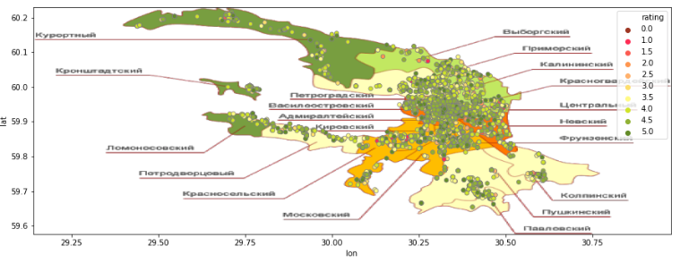
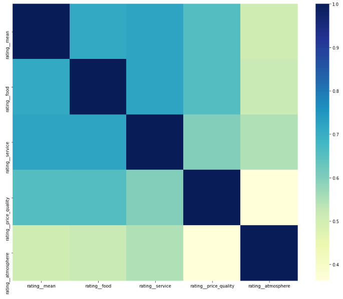
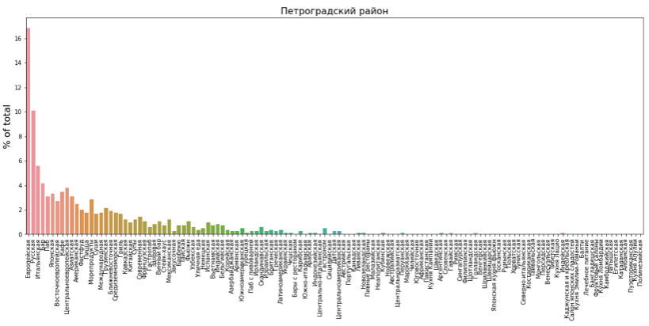

# Analytical project of St. Petersburg restaurants

## Requirements
- ```brew``` pre-installed or install it via:
```bash
/bin/bash -c "$(curl -fsSL https://raw.githubusercontent.com/Homebrew/install/master/install.sh)"
```
- ```python 3``` pre-installed or install it via:
```bash
brew install python
```
- ```Docker``` pre-installed or install it via:
```bash
brew cask install docker

# run docker app to launch docker-machine process in background via command or do it manually
open -a Docker
```

---

## Usage
### Clone and start
```bash
# Clone the repository
git clone https://github.com/ValeryVolokha/SPbRestaurantsAnalyticalProject

# Enter folder
cd SPbRestaurantsAnalyticalProject
```

It's more convenient to use isolated docker containers for Spark and MongoDB and ```docker-compose``` utility with ```docker-compose.yml``` file to setting and starting containers. 

```bash
# Start containers
docker-compose up
# or recreate and then start containers if needed to start from scratch
docker-compose up --force-recreate
```

This creates 2 connected pyspark and mongo containers and forwards pyspark container's port 8888 to host's port 9999.
Also it's creates collection ```test.rests``` in mongodb in mongo container and restore it from ```tripadvisor_restaurants.json``` file.

```bash
# install some requirement libs
docker exec -it pyspark bash -c "pip install -r work/requirements.txt"
```

Go to ```http://localhost:9999/``` and open ```/work/analysis.ipynb``` file.

---

## Scraping and crawling data
Crawler code is contained in the ```crawler``` folder, mainly in the ```TripAdvisor.py``` file. If desired, the code can be changed, for example by changing the ```start_page```, and used it to parse other information from the site, such as hotels for example. 

> Warning: may take a long time. It's already done and saved in ```tripadvisor_restaurants.json``` file.

```bash
# Run spider
docker exec -it mongo bash -c \
	"scrapy crawl TripAdvisor_restaurants"
```

As a result, will be created ```tripadvisor_restaurants.json``` file

### Loading data to MongoDB
#### Easy way: restart containers
```bash
# ctrl/cmd + C to stop containers or use Docker Dashboard GUI

# then start containers back
docker-compose up --force-recreate
```
#### Another way: use ```mongoimport``` tool inside ```mongo``` container
```bash
# Load data to storage using mongoimport tool to rests collection
docker exec -it mongo bash -c \
	"mongoimport --jsonArray \
				 --db test \
				 --collection rests \
				 --drop \
				 --file /work/tripadvisor_restaurants.json"

# Check the result
docker exec -it mongo bash -c 'mongo --eval "db.rests.findOne({})"'
```

The result should contain and looks like:
```jsonc
// ...
{
	"_id" : ObjectId("5f05ce4b7550949dd7e1cd2e"),
	"name" : "Ресторан Тбилисити",
	"address" : "Литейный проспект 10 Рядом с Radisson Sonya Hotel, Санкт-Петербург 191028 Россия",
	"district" : "центральный",
	"coords" : {
		"coords__lat": 30.349045,
		"coords__lon":  59.945959
	},
	"rating" : {
		"rating__mean" : 4.5,
		"rating__food" : 4.5,
		"rating__service" : 5,
		"rating__price_quality" : 4.5,
		"rating__atmosphere" : 4.5
	},
	"check_group" : "По умеренной цене",
	"kitchen_types" : [
		"Европейская",
		"Русская",
		"Кавказская",
		"Грузинская"
	],
	"comments" : {
		"comments__count" : 142,
		"comments" : [
			{
				"comment__rating" : 5,
				"comment__body" : "..."
			},
			// ...
		]
}
```
Schema structure:
```
root
 |-- _id: struct
 |    |-- oid: string
 |-- address: string
 |-- check_group: string
 |-- comments: struct
 |    |-- comments__count: integer
 |    |-- comments: array
 |    |    |-- element: struct
 |    |    |    |-- comment__rating: double
 |    |    |    |-- comment__body: string
 |-- coords: struct
 |    |-- coords__lat: double
 |    |-- coords__lon: double
 |-- district: string
 |-- kitchen_types: array
 |    |-- element: string
 |-- name: string
 |-- rating: struct
 |    |-- rating__mean: double
 |    |-- rating__food: double
 |    |-- rating__service: double
 |    |-- rating__price_quality: double
 |    |-- rating__atmosphere: double
```

---

## Results
Analytics is presented in the file ```analysis.ipynb```

During the work, a dataset describing the restaurants of St. Petersburg was parsed and formed. The scheme and model fields are above. Then, lost (not indicated on the site) data that was important was restored, for example, the district in which the restaurant is located, its coordinates, etc. Geopy and the Nominatim system were used for it.

Further, the coordinates of the restaurants were plotted on a map of St. Petersburg to assess the density and distribution of restaurants in the districts of the city, as well as comparison with the average ratings of these restaurants. More details in the file, where detailed tables with statistics are also given.



A heat map of the correlation of the ratings that visitors give the restaurant and how much the ratings for individual criteria affect the overall rating that the visitor puts (overall rating! = average by criteria) was also compiled.



You can see that although the difference is not significant, however, the quality of service affects the final grade more than the quality of the food and other criteria.

The distribution of various types of kitchen by city districts was also estimated, as well as the distribution of ratings for them. More information in ```analysis.ipynb``` where tables with values are given. Also, for each district, histograms were compiled of the percentage of the number of restaurants of this kitchen type to the rest. Example below.



At the end, a function was written to display a word cloud for each restaurant. As you can see below "Necanon" (НЕКАНОН) is suitable for groups of friends, lovers of superhero themes, as well as lovers of unusual cocktails. And Cafe Zinger (Кафэ Зингеръ) is a very cosy place with beautiful views of the Kazan Cathedral and a wide selection of delicious food.


